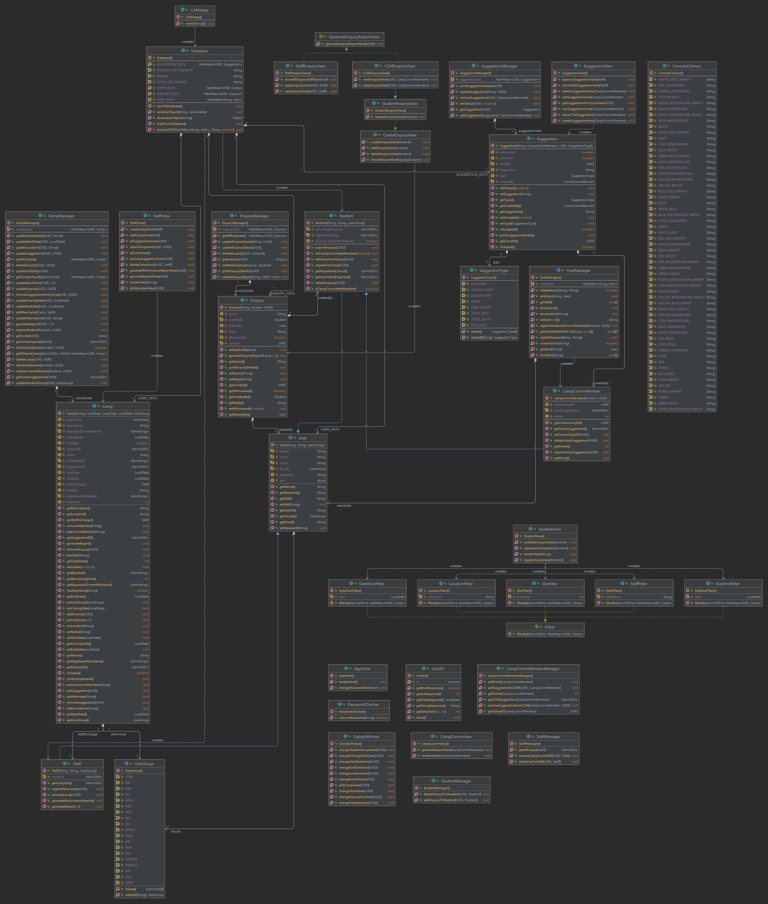

# Camp Application and Management System (CAMs)

Object-Oriented Command Line Interface (CLI) Application. CAMs is centralised system that allows staff and students to
manage, view and register for camps within NTU. The application adopts a **Model-View-Controller (MVC)** architecture, 
separating into three primary components according to their roles, creating more modular code. It is also designed to
closely adhere to **SOLID design principles**, fostering a more efficient and streamlined development process. 

Key Features:

- Authentication management (Password-strength checking, salting and hashing)
- Data persistence via object serialisation and Base64 encoding
- Colour-coded User Interface
- Robust error checking

## Getting Started

> Developed with Java 11.0.15 and Apache Maven 3.8.1

#### File structure

```terminal
.
├── docs                    # Javadocs html files
├── src                     # Java source files (Maven directory layout)
│   ├── main          
│   │   ├── java           
│   │   │   ├── com.cmas            
│   │   │   │   ├── controller                    # Controller classes
│   │   │   │   ├── database                      # Database classes
│   │   │   │   ├── filter                        # Filter classes (Sorting utility)
│   │   │   │   ├── helper                        # Utility classes (IO Classes)
│   │   │   │   ├── model                         # Model classes
│   │   │   │   ├── view                          # View classes
│   │   │   │   └── main                          # Application main class
│   │   │   └──
│   │   └──
│   └── ...
└── ...
```

#### Project Setup

- Clone the repository and ensure you have the required Java and Maven versions installed.
- Build the project with `CAMsApp` as the Main class. 
- Run `CAMsApp`

## UML Diagram



## Contributors

- [Lau Quan Feng Ryan](https://github.com/RyanLauQF)
- [Tan Shao Chong](https://github.com/ackselz)
- [Tong Ying](https://github.com/TY0018)
- [Yu Seung Yeon](https://github.com/aviannayu)
- [Markus Lim En Cheng](https://github.com/mcxpm)
